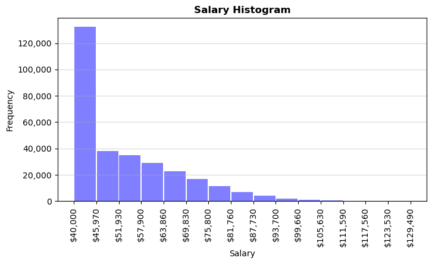

# SQL-challenge
### Data Modeling, Engineering & Analysis of a relational employee database using SQL

#### Description
The scope of this project is to design a database schema to hold data contained in CSV files, import the data into a Relational Database Management System (RDMS) and execute queries to analyse employees legacy data of a sample corporation.

#### Script Summary
This script takes advantage of PostgreSQL as the RDMS along with pgAdmin for the user interface. For further analysis and data visualization, the SQL database was imported into Pandas using SQLAlchemy and Jupyter Notebook.

#### Workflow

##### 1. Data Modeling
The CSV files were thoroughly inspected in order to define the database structure to hold the data. The result is displayed on the following Entity Relationship Diagram (ERD):

 

##### 2. Data Engineering
The database was built in three steps:
+ The table schemata was created specifying data types, primary keys, foreign keys and other constraints in order to implement the ERD into the RDMS.
+ Tables were created in the order depicted in the ERD to handle foreign keys adequately.
+ CSV files were imported in the same order to mantain tables relationships and database integrity.

##### 3. Data Analysis
SQL statements were used to query data from the database in order to list employees details using the following tools:
+ Filtering (using conditionals)
+ Merging (through junction tables)
+ Ordering
+ Grouping (data aggregation)
+ Type Casting

 

##### 4. Data Visualization
A statistical analysis was carried out to validate salary data and the results were plotted to generate a visual outcome:

##### Note
Jupyter Notebook `4_Analysis.ipynb` is not correctly displayed in the GitHub interface. It is strongly suggested to download related files in order to run them natively.